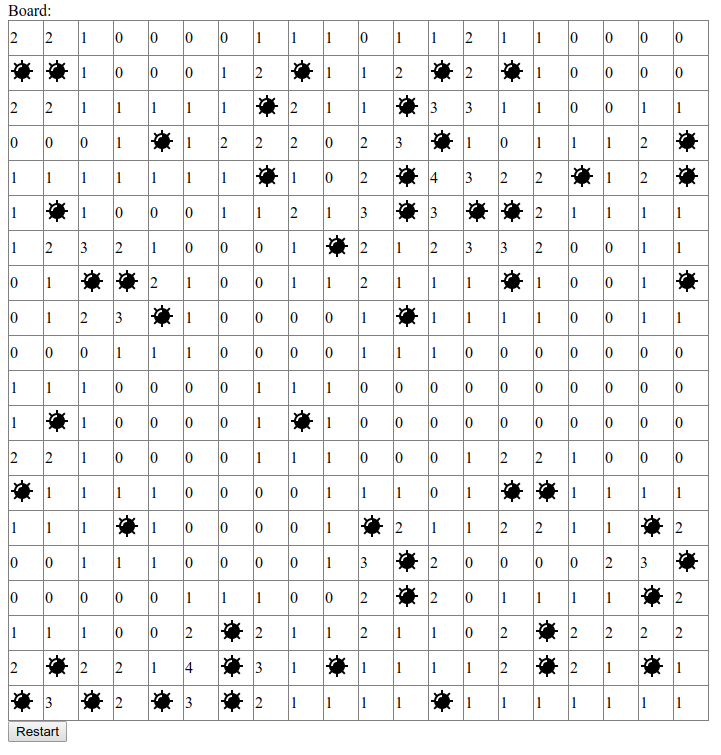

# Minesweeper built in Angular

[Play the game](https://stephenfluin.github.io/angular-minesweeper/)

## Development
All custom code lives in /src/app

* `ng serve` to do live development reload
* `ng build`
* `npm run deploy` to build and publish to GitHub Pages (via [angular-cli-ghpages](https://www.npmjs.com/package/angular-cli-ghpages))